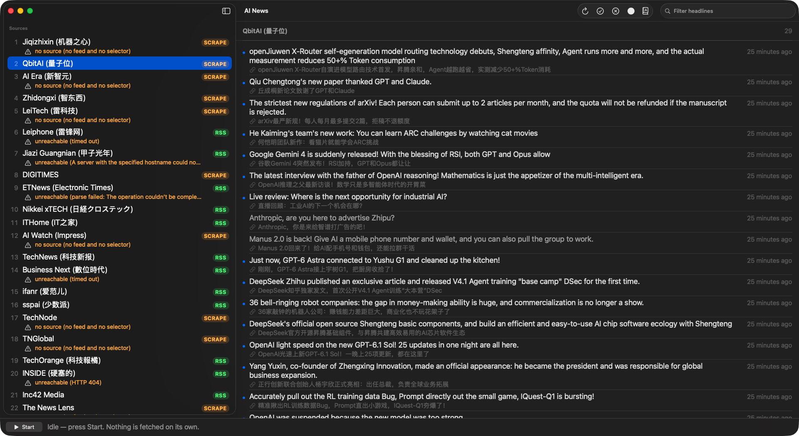

# AI News

A personal, single-user macOS app that collects tech and AI headlines from Asian
sources, so that no US-centric aggregator sits between you and the publisher.
Headlines are stored locally; reading happens on the publisher's own page, in
your own browser.

Headlines come from each source's own feed where one exists, and from its
homepage where none does — a feed is preferred because it is the publisher's own
structured output. Of the 30 sources listed, 18 are active: 12 provide a feed and
6 are read by scraping. The other 12 are parked, with the reason shown in the
sidebar.

---

## Requirements

- macOS 26 (verified on 26.6.2)
- Xcode 26.6
- No third-party dependencies, no package manager, no Homebrew

## Build and run

    xcodebuild -project AINews.xcodeproj -scheme AINews -configuration Debug build
    open AINews.xcodeproj      # then ⌘R

Or just open the project in Xcode and press ⌘R. Press **Start** in the bottom bar
to fetch. Nothing is fetched automatically.

### Standalone bundle

To produce a double-clickable `AI News.app` in `build/`:

    xcodebuild -project AINews.xcodeproj -scheme AINews -configuration Release \
      CONFIGURATION_BUILD_DIR="$PWD/build" build

That yields `build/AINews.app` — universal (arm64 + x86_64), ad-hoc signed, so
it runs locally without a developer certificate. It is not notarised, so do not
hand it to anyone else; Gatekeeper will refuse it on their machine.

The bundle is self-contained: `sources.json` ships inside
`Contents/Resources/`. Its SwiftData store is still created outside the
bundle, in Application Support, so replacing the bundle never loses headlines.

Tests: ⌘U, or

    xcodebuild -project AINews.xcodeproj -scheme AINews test

The store lives at
`~/Library/Application Support/AINews/AINews.store`. Delete that folder to
start over.

---

## Layout

    AINews/
      AINewsApp.swift          @main, ModelContainer, scenes
      Models/                  Source, Headline  (SwiftData)
      Services/
        FetchStrategy.swift    SourceFetching protocol + FetchRouter
        FeedFetcher.swift      the only v1 strategy
        FeedParser.swift       RSS 2.0 / RSS 1.0 (RDF) / Atom
        HTTPClient.swift       ephemeral URLSession, redirect cap
        AggregationEngine.swift  actor: routing, pacing, cooldown, policy
        SourceImporter.swift   sources.json -> SwiftData upsert
      State/                   AggregatorStore, SwiftDataPersistence
      Views/                   ContentView and friends
    ../Resources/sources.json  bundled seed (authoritative for editorial fields)

`AINews-Info.plist` carries the ATS exception and must stay outside the
synchronized source folder so Xcode does not also copy it as a resource.

---

## How a run behaves

Sources are fetched **strictly one at a time**, in the editorial AI-first order
from `sources.json`, with a random 5–10 s pause between them (configurable in
Settings).

For each source the engine decides:

| Situation | Result |
|---|---|
| Inactive | never requested under any circumstance |
| Has a feed | feed fetched and parsed |
| No feed | homepage fetched and scraped |
| Inside its cooldown | skipped, silently |
| Headlines parsed | stored, deduplicated by URL |
| 403 / 429 | warned `blocked` |
| 5xx | warned `server error` |
| Timeout, DNS, TLS | warned `unreachable` |
| Parsed but zero items | warned `empty feed` |

**Nothing is ever deactivated automatically.** A source that cannot be read is
unsupported, not dead — scraping may fix it later. Only you can disable a source
(right-click it in the sidebar). Failures are counted and shown so the problem
stays visible.

---

## Keyboard

| Shortcut | Action |
|---|---|
| ⌘K | **Mark read** — the selected source, or every source when nothing is selected |
| ⌘↩ | Start a run |
| ⌘⇧R | Reload Sources (re-applies `sources.json`) |
| ⌘+ | Bigger text |
| ⌘− | Smaller text |
| ⌘0 | Actual size |

⌘K is one key with one meaning, and the sidebar decides the scope: there is no
second shortcut to remember, and no way to clear 30 sources by accident while
working through one. It is the shortcut NetNewsWire uses for the same action,
so it is where a Mac reader already expects it.

---

## Feed status, measured against the live sites

Verified by running the real parser against all 17 feeds:

| Parsed correctly | Format |
|---|---|
| 雷锋网 · 日経クロステック · IT之家 · TechNews · 爱范儿 · 少数派 · TechOrange · Inc42 · TheBridge · 東洋経済 · Yonhap · Nikkei Asia | RSS 2.0, RSS 1.0 (RDF) and Atom all confirmed working |

| Not working | Reason |
|---|---|
| ETNews | `/rss/` serves the HTML homepage, not a feed |
| INSIDE, 數位時代, ZDNet Korea | feed URL returns HTTP 404 — the path has moved or been withdrawn |
| 甲子光年 | third-party host `werss.bestblogs.dev` did not respond |

Nikkei Asia's URL was corrected from `/rss` to `/rss/feed/nar` during this
verification. The remaining five need scraping, which is why the scrape seam
exists.

The 13 sources with no feed at all (机器之心, 量子位, 新智元, 智东西, 雷科技,
DIGITIMES and others) are reported as `no source` and skipped.

---

## How many headlines are kept

Two settings in **Settings › Storage**, because headlines accumulate forever
otherwise — feeds limit only what is *added* per run, never what builds up.

| Setting | Default | What it does |
|---|---|---|
| Show per source | 100 | How many appear in the list |
| Keep per source | 200 | How many are stored; older ones are pruned as new ones arrive |

More is kept than shown deliberately: a headline that scrolls out of a feed's
window stays remembered as seen, so it is not re-added and translated again
later. A group that is truncated says so in its header — `100 of 340` — rather
than silently dropping rows.

This also bounds memory. The list loads stored headlines to draw them, so
without a retention limit every launch would pull the whole archive into memory
to render a list nobody scrolls to the end of.

---

## Translation

Headlines are translated into English **on the machine**, using Apple's
Translation framework. There is no service, no API key, no billing, and no
headline ever leaves the Mac — routing them through Google, DeepL or an LLM
would put a third party back between you and the publisher, which is the whole
thing this app exists to avoid.

- Translation runs **while the engine is pausing between sources**, so it costs
  no extra wall-clock time. You will see `translating` in the status bar.
- The **English headline is the first line** and the publisher's own words sit
  beneath it. The **Originals** toolbar button swaps them.
- Each headline is translated **once, ever** — the store dedupes by URL — so a
  second run only translates what is genuinely new.
- Text already in English is skipped rather than duplicated.
- Turn it off entirely in **Settings › Language**.

The first run may prompt macOS to download a language pack. That is a one-time
system download handled by the OS, not by this app.

---

## App icon

The icon lives in `AINews/Assets.xcassets/AppIcon.appiconset` as the ten
sizes macOS expects (16 through 512, each at 1x and 2x). The build setting
`ASSETCATALOG_COMPILER_APPICON_NAME = AppIcon` points the target at it, so
Xcode compiles it into `AppIcon.icns` and `Assets.car` automatically.

`Icon/` holds the source artwork, outside the app target so it is never
bundled:

| File | What it is | In the repo? |
|---|---|---|
| `Icon/appicon-1024.png` | The artwork with the macOS icon geometry applied, and the source every size is generated from | Yes |
| `Icon/appicon.png` | The original 2048x2048 artwork, untouched | No - 4.6 MB, gitignored, kept locally |

**Why there are two.** The original has no alpha and its content runs edge to
edge, so macOS would have drawn it as a hard square next to every other
rounded icon. `appicon-1024.png` is the artwork scaled into an 824pt rounded
square with a 185pt corner radius, centred on a transparent 1024pt canvas,
which is the geometry Apple uses for macOS app icons. Regenerate the set from
that file if the artwork ever changes:

    for s in 16 32 64 128 256 512 1024; do
      sips -z $s $s Icon/appicon-1024.png --out /tmp/icon-$s.png
    done

To go back to a plain square icon, point the appiconset at the original
artwork instead and drop the shaping step.

---

## Running it from the Dock

Yes - drag `build/AINews.app` onto the Dock. The Dock stores a reference to
that path, not a copy, so whatever bundle sits at that path is what launches.

**The trap:** Xcode's Cmd-R builds into DerivedData, not into `build/`. Those
are two different apps, and the Dock only ever sees the one in `build/`. Edit
code, hit Cmd-R, and the app you launch from the Dock is still the old build.

So there are two workflows, and it is worth picking one deliberately:

| Workflow | How | Dock stays current? |
|---|---|---|
| Everyday use | `./build.sh` | Yes |
| Active development | Cmd-R in Xcode | No - Cmd-R runs from DerivedData |

`./build.sh` wipes and rebuilds `build/AINews.app` in place, so a Dock icon
pointing at it keeps working and picks up the new code on the next launch.

Two things to know:

- **Quit the app before rebuilding.** Replacing a bundle while it runs leaves
  the old process running the old code; the next launch gets the new build.
- **Re-drag only if the app moves.** The Dock reference follows the path, so
  rebuilding in place never needs a re-drag. Delete or move `build/` and the
  Dock icon turns into a question mark.

If macOS shows a stale icon after an icon change, `killall Dock` refreshes it.

---

## Editing the source list

`Resources/sources.json` **seeds a fresh install and is otherwise reference
material.** It is not reapplied on every launch, because the importer deletes
any source absent from the file along with that source's headlines — so an
edited or truncated file would be destructive rather than merely stale.

What that means in practice:

| Situation | What happens |
|---|---|
| First launch, empty store | The file is imported |
| Ordinary launch | The file is **not** read; the store is authoritative |
| You edit the file | Nothing changes until you apply it |
| **Reload Sources** (⌘⇧R) | Re-applies the file: refreshes editorial fields and **adds or removes** sources and their headlines to match |

So the file is still how you add a source or fix a feed URL — you just apply
it deliberately instead of having it applied behind you.

    {
      "source_id": "ithome",
      "name": "ITHome (IT之家)",
      "url": "https://www.ithome.com",
      ...
    }

`source_id` is the identity. Headlines are stored against it, so it survives
any edit to the name, URL or feed. Renaming a source is now completely safe —
change `name` and nothing else, and its headlines follow.

An entry with a **missing or duplicate** `source_id` is skipped and reported
rather than guessed at, so a typo cannot silently create a second copy of a
source and orphan the first one's headlines.

### Skipping a source

Right-click a source in the sidebar and choose **Skip This Source**. It is
dimmed and badged, and runs leave it alone until you choose **Don't Skip This
Source**.

This is owned by the app, not the JSON: `inactive` in `sources.json` seeds a
source's state when it is first imported, but re-importing never overrides a
choice you made in the app. Editing `inactive` for a source that already
exists will therefore have no effect — use the context menu instead.

A re-import updates name, URL, feed URL, status, note, rank and the inactive
flag, and **never touches** failure counters, timestamps or warnings. Removing a
source from the file deletes it and its headlines.

---

## Notes

- **ATS**: 雷锋网's feed is plain `http://`, which App Transport Security
  refuses by default. `AINews-Info.plist` carries a narrow exception for
  `leiphone.com` only. If you add another plain-HTTP source, it needs its own
  entry or it will fail with an unhelpful error.
- **Not sandboxed**, deliberately. Enable the sandbox and you must also add
  `com.apple.security.network.client`.
- **No scheduler.** The app never wakes itself; every run is started by you.
- Opening a headline hands the URL to your default browser, so the publisher
  sees a normal visit and your extensions and cookies apply.

---

Made with ♥️ by DeepSeek
